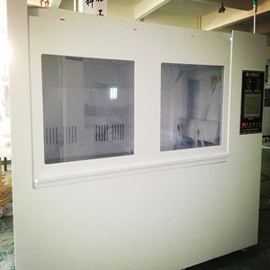
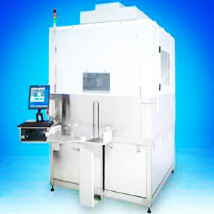
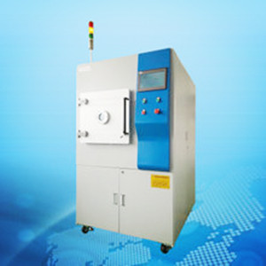

# 欢迎来到鑫翝瑞电子科技有限公司 XHR-ETC
Nanjing Xin Hong Rui Electronic Technology Co., Ltd

## 公司简介 Company Profile

南京鑫翝瑞电子科技有限公司自1998年成立以来，主要从事先进半导体设备与电子设备的技术研发和配件销售。在南京，上海，杭州，苏州，无锡，常州，镇江，扬州的主要半导体电子设备大客户所在地区，常年住有销售和技术工程师。同时，我们专业的技术团队也提供远程优质，高效的技术支持和客户服务。

The XHR-ETC since its inception in 1998, mainly engaged in advanced semiconductor equipment and electronic equipment, technology research and development and sales of accessories. In Nanjing, Shanghai, Hangzhou, Suzhou, Wuxi, Changzhou, Zhenjiang, Yangzhou, the main semiconductor electronic equipment where the major customers, perennial live sales and technical engineers. At the same time, our professional technical team also provides remote high quality, efficient technical support and customer service.

## 企业愿景 Corporate Vision

我们的宗旨和目标是竭诚服务客户，与客户一起共同成长! 

Our aim and goal is to serve customers, and customers together to grow together!

## 主要产品 Main Products

### ST100-SJ 先进基片清洗台

ST100-SJ 兆声单晶圆&掩模清洗(SWC)系统，用于先进的无损兆声清洗。可以适用于易受损的带图案或无图案的基片，包含带保护膜的掩模版。为了在确保不损伤基片的情况下达到最优化的清洗效果，兆声能量的密度必须保持在稍稍低于样片上任意位置上的损伤阈值。German Fisrt Nano System 专利技术确保了声波能量均匀分布到整个基片表面，通过分布能量的最大化支持最理想的清洗，同时保证在样片的损伤阈值范围内。

#### 应用：
硅片
蓝宝石片
晶圆框架上的芯片
显示面板
ITO涂敷的显示屏
有图案及无图案掩模版
掩模版空白处
带保护膜的分划板
接触掩模版

#### 产品主要特点：
大基片清洗机
台式单元
无损兆声掩模版或晶圆片清洗
12”圆片，9”方片
微处理器控制
IR红外灯
SWC-3000选配项：
带兆声的大环境腔体
DI，刷子，热N2
化学试剂滴胶臂
带化学试剂滴胶的不同转速的刷子
PC控制的系统，带Labview软件
触摸板用户界面
手动放片取片
安全联锁及报警
30”D x 26”W占地面积

根据不同的应用，某些选配件将会进一步提高设备的能力，达到更好的去处不想要的颗粒和残留物的效果。
#### 选配项：
掩模版或晶圆片托盘
刷子清洗
化学试剂清洗(CDU)
氮离子发生器
化学试剂输送模块
Piranha溶液清洗
臭氧化去离子水(20ppm的O3)
氢化的去离子水
高压去离子水
加热的去离子水
溶剂和酸分开排放
红外加热
去离子水循环器
耐火立柜
带EFM以及SMIF界面的机械手载片/取片

### VM100-TK 大尺寸兆声基片清洗台

本设备采用最先进的兆声无损处理设备，主要包含SWC单晶圆/掩模版清洗系列和LSC大基片清洗系列，支持湿法清洗/去胶/刻蚀应用。系列型号包含ST100-SJ、ST1000-SJ、ST1000-FJ。
兆声单晶圆及掩模版清洗机提供高可重复性、高均匀性及最先进的兆声清洗。它可以在一个工艺步骤中包含了专利的无损兆声清洗、化学试剂清洗、刷子清洗以及干燥功能。为了实现基片无损情况下的最大程度的清洗优化，兆声能量强度必须确保稍稍低于样片上的任何点的受损阈值。本设备可以确保兆声能量均匀分布于整个基片表面，可以做到分布能量最大化的同时又确保稍低于样片受损阈值，从而实现最理想的清洗效果。

#### 应用：
* 有图案和无图案掩模版及晶圆片
* Ge, GaAs和InP晶圆片清洗
CMP化学机械抛光后晶圆片清洗
晶圆片框架上的切片小芯片清洗
等离子刻蚀或光刻胶剥离后的清洗
带保护膜的分划板清洗
掩模版空白处或接触掩模版清洗
X射线及极紫外掩模版清洗
光学镜头清洗
带ITO涂层的显示面板清洗
兆声辅助的玻璃工艺

#### 产品主要特点：
12”外径或7”x7”基片
独立的系统单元
无损兆声，化学试剂，刷子清洗和旋转甩干
微处理器控制
化学试剂分发单元
溶剂和酸分开排放
热氮
30”深 x 26”宽的占地面积

根据不同的应用，某些选配件将会进一步提高设备的能力，达到更好的去处不想要的颗粒和残留物的效果。
#### 选配项：
掩模版或晶圆片托盘
臭氧清洗
刷子清洗
高压去离子水清洗
氮离子发生器
SWC-3000产品主要特点：

### XR-B 真空烘箱

XR-B 烘箱比传统装置的干燥速率快 6 倍。 这种烘箱具有极佳的热转换以及快速的升温时间，从而将装置运行时间降至最低。我们的真空干燥箱产品组合包含多个产品线以应对不同应用需求，从快速真空干燥到复杂的温和干燥以及真空或惰性气体保护下的特定加热。同时，我们提供一系列附件来提高和优化您的实验室烘箱和熔炉的性能，包括烘箱落地支架和堆叠套件以及马弗炉排气连接和架子与搁板。

## 联系方式 Contact Information

电话: 025-84541962, 15951729999

TEL: 025-84541962, 15951729999

地址：南京市中山东路110号

Address: 110 Zhongshan Road, Nanjing, China

